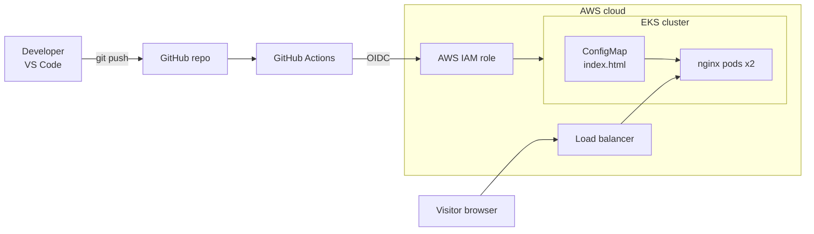

# eks-nginx-demo
## Architecture

```mermaid
flowchart LR
    Dev[Developer<br/>VS Code] -->|git push| Repo[GitHub repo]
    Repo --> GHA[GitHub Actions]
    GHA -->|OIDC| IAM[AWS IAM role]
    IAM --> EKS

    subgraph AWS[AWS cloud]
        IAM
        subgraph EKS[EKS cluster]
            CM[ConfigMap<br/>index.html] --> Pods[nginx pods x2]
        end
        LB[Load balancer] --> Pods
    end

    User[Visitor browser] --> LB
```
